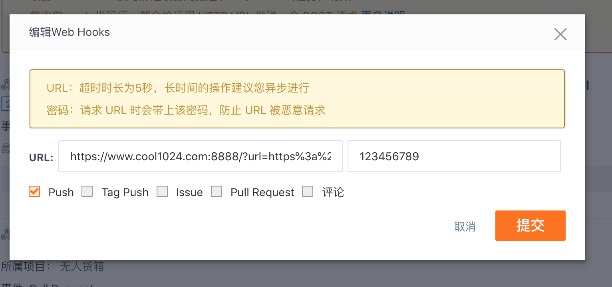

# Gitee Webhook服务器脚本

## 运行接收Webhook消息的服务器(默认8888端口，网站地址根据项目自行更改)
`php hook-server.php &`

## Gitee Webhook配置说明


1. URL为你的脚本服务器请求地址加上一个url参数，url参数需要进行urldecode（可以使用在线编码工具）
2. 123456789为Gitee密码，自行设置
3. https://www.cool1024.com:8888/?url=https%3a%2f%2fwww.cool1024.com%2fpull
 * 其中的url=（你的项目权限验证api地址，如这里的是https://www.cool1024.com/pull）,我们把这个接口写在了项目中。这个接口会返回项目地址，你需要提供密码，代码如下
 ```php
 $router->get('/pull', function () {
    // 安全密码
    $password = env('GIT_PULL_PASSWORD', '这个是安全密码，需要自己去env文件中设置');
    // 仓库路径
    $git_path = realpath(__DIR__ . '/..');
    return $_GET['password'] !== $password ? 'ERROR' : $git_path;
});
 ```

## ENV配置，我们的密码（如：123456789）在.env文件中需要设置

```conf
GIT_PULL_PASSWORD=123456789
```

## 原理
1. 每次代码提交操作，Gitee会发送一个POST请求（附带了我们预设的密码，防止别人恶意请求）到hook-server.php运行的服务器上
2. hook-server把请求中的url参数，password参数提取出来
3. hook-server发送url（上面传过来的）请求到我们的项目pull接口，如果接口密码验证成功，那么我们会得到一个项目更新地址
4. hook-server在指定的项目地址执行git pull
5. 返回更新结果到Gitee

### 环境安装

### pecl切换php版本
1. sudo pecl config-set php_bin /usr/bin/php7.2
2. sudo pear config-set php_suffix 7.2

### 安装依赖支持
1. php7.2-dev
`sudo apt-get install php7.2-dev`
2. swoole
`pecl install swoole`如果要使用https需要回答ssl支持为yes
3. 把swoole.so配置到到cli的配置文件中
